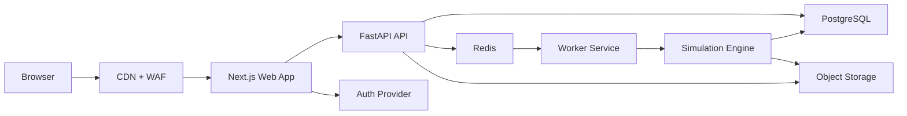

# Bio Soil Platform Architecture

## Positioning

This platform should feel like a premium scientific product, not a generic calculator site. The architecture is designed to support:

- a world-class public website with strong storytelling, SEO, and editorial control
- a secure product application for calculator workflows, simulations, reports, and client dashboards
- a scientific backend that can run deterministic, versioned, auditable soil food web models
- enterprise-grade operations: monitoring, background jobs, reproducibility, and controlled deployments

## Recommended Stack

### Frontend

- `Next.js` with App Router
- `React` with TypeScript
- `Tailwind CSS` plus a custom design token layer in `packages/design-tokens`
- `TanStack Query` for client-side server state where needed
- `MDX` or a headless CMS later for long-form marketing content

### Backend

- `FastAPI` for the API layer
- `Pydantic` for schema validation
- `SQLAlchemy` and `Alembic` for persistence and migrations
- `PostgreSQL` for primary data storage
- `Redis` for job queueing and caching

### Scientific Compute

- Python simulation engine in a dedicated service package
- `NumPy`, `SciPy`, `Pandas`, and `NetworkX` for modeling and analysis
- background workers for long-running simulations and decomposition runs

### Platform

- OpenAPI-first contracts, with generated TypeScript client code in `packages/api-client`
- object storage for exported reports, run artifacts, and uploaded datasets
- structured logs, tracing, and error monitoring from day one

## System Overview



## Architectural Principles

- Keep the public marketing experience and the scientific application in one brand system, but not in one tangled code path.
- Never run serious simulations directly inside Next.js route handlers.
- Treat every simulation as a first-class record with input snapshots, engine version, parameter version, timestamps, and result artifacts.
- Separate the scientific engine from the API transport layer so the modeling code can evolve safely and be tested in isolation.
- Generate API contracts for the frontend instead of hand-maintaining duplicated request and response types.
- Build a design system early so the product experience looks premium and consistent across marketing and application surfaces.

## Core Product Domains

These should become the main business entities in the database and API:

- organizations
- users and roles
- projects
- soil samples
- food web definitions
- parameter sets
- simulation scenarios
- simulation runs
- run artifacts and exports
- reports

## Runtime Design

### `apps/web`

Responsibilities:

- public marketing website
- SEO landing pages
- case studies, science pages, blog, and lead capture
- authenticated product UI
- dashboards, calculators, simulation setup, results visualization, and reports

Recommended route split:

- `src/app/(marketing)` for the brand site
- `src/app/(platform)` for the logged-in product

### `services/api`

Responsibilities:

- authentication and authorization enforcement
- project, sample, scenario, and report APIs
- input validation and business rules
- simulation job submission and status APIs
- result retrieval
- audit logging and API documentation

### `services/worker`

Responsibilities:

- execute asynchronous simulations
- process decomposition jobs
- generate heavy reports and export files
- publish status updates and persist outputs

### `services/simulation-engine`

Responsibilities:

- flux calculation
- direct and indirect mineralization contribution analysis
- stability and `smin` calculation
- non-equilibrium simulation
- detritus decomposition simulation and decomposition constant calculation

This package should be pure, testable, and independent from FastAPI request handling.

## Monorepo Structure

```text
bio_lab/
├── apps/
│   └── web/
│       ├── public/
│       └── src/
│           ├── app/
│           │   ├── (marketing)/
│           │   └── (platform)/
│           ├── components/
│           ├── content/
│           ├── features/
│           │   ├── admin/
│           │   ├── auth/
│           │   ├── calculator/
│           │   ├── dashboard/
│           │   ├── marketing/
│           │   └── simulations/
│           ├── hooks/
│           ├── lib/
│           │   ├── analytics/
│           │   ├── api/
│           │   └── auth/
│           ├── styles/
│           └── tests/
│               ├── e2e/
│               └── integration/
├── services/
│   ├── api/
│   │   ├── alembic/
│   │   │   └── versions/
│   │   ├── app/
│   │   │   ├── api/
│   │   │   │   └── v1/
│   │   │   │       └── routes/
│   │   │   ├── core/
│   │   │   ├── db/
│   │   │   ├── domain/
│   │   │   ├── models/
│   │   │   ├── observability/
│   │   │   ├── repositories/
│   │   │   ├── schemas/
│   │   │   ├── services/
│   │   │   └── tasks/
│   │   └── tests/
│   ├── simulation-engine/
│   │   ├── notebooks/
│   │   ├── soil_engine/
│   │   │   ├── common/
│   │   │   ├── decomposition/
│   │   │   ├── dynamics/
│   │   │   ├── flux/
│   │   │   ├── mineralization/
│   │   │   └── stability/
│   │   └── tests/
│   └── worker/
│       ├── app/
│       │   ├── jobs/
│       │   ├── runners/
│       │   └── telemetry/
│       └── tests/
├── packages/
│   ├── api-client/
│   ├── config-eslint/
│   ├── config-typescript/
│   ├── design-tokens/
│   ├── ui/
│   └── validation/
├── infra/
│   ├── docker/
│   ├── monitoring/
│   └── terraform/
│       ├── environments/
│       │   ├── dev/
│       │   ├── production/
│       │   └── staging/
│       └── modules/
├── docs/
│   └── architecture.md
├── scripts/
├── tests/
│   ├── contract/
│   └── performance/
└── README.md
```

## Why This Structure Works

### Brand and product can evolve independently

Your public site will likely grow into pages for research, case studies, labs, advisory services, education, partner programs, and conversion funnels. The product application will evolve on a different cadence. This layout keeps them in one flagship web experience while preserving clean product boundaries.

### Simulations stay reliable

The core soil engine is isolated from the HTTP layer. That means we can validate scientific correctness with focused tests, benchmark performance, and version outputs with confidence.

### Scale is built in

Synchronous API requests can stay fast while heavy work moves to workers. That is important for long-running runs, decomposition analyses, and future batch processing.

### Enterprise standards are easier to enforce

Infrastructure, tests, monitoring, generated contracts, and shared design tokens all have clear homes. That reduces entropy as the team grows.

## Execution Boundaries

Use synchronous API requests for:

- browsing projects and samples
- saving calculator inputs
- validating configurations
- fetching previously computed results

Use asynchronous jobs for:

- full food web simulation runs
- long decomposition jobs
- large report generation
- expensive sensitivity analysis or future Monte Carlo runs

## Quality Standards To Build In Early

- role-based access control from the first authenticated release
- audit trail for simulation inputs and outputs
- reproducible run metadata including engine version
- contract testing between web and API
- end-to-end tests for critical product flows
- performance budgets for public pages
- observability across web, API, worker, and simulation engine

## Recommended Next Build Steps

1. scaffold `apps/web` with Next.js, TypeScript, Tailwind, and route groups
2. scaffold `services/api` with FastAPI, SQLAlchemy, Alembic, and health endpoints
3. scaffold `services/simulation-engine` as a Python package with placeholder modules for the five core functions
4. define the first database schema for users, projects, samples, scenarios, and runs
5. generate the first OpenAPI-driven TypeScript client for the web app
