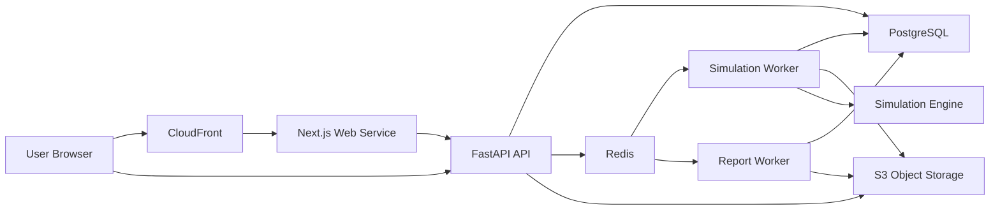

# Deployment Architecture

## Recommendation

Use an AWS-based reference architecture for the first production deployment:

- compute: ECS on Fargate
- image registry: ECR
- web edge: CloudFront + ACM + Route 53
- web and API ingress: ALB
- database: RDS PostgreSQL
- queue/cache: ElastiCache Redis
- object storage: S3
- secrets: Secrets Manager + SSM Parameter Store
- observability: OpenTelemetry + CloudWatch + Managed Prometheus/Grafana + Sentry
- infrastructure as code: Terraform

This is the best fit for the current product stage because it gives:

- isolated environments
- controlled container deployments
- separate scaling for API and worker workloads
- strong operational primitives without early Kubernetes overhead

## 1. Environment Topology

## Environments

### Local

Purpose:

- developer workflows
- contract testing
- integration testing

Stack:

- Docker Compose
- local Postgres
- local Redis
- MinIO for S3-compatible artifact testing
- optional local OpenTelemetry collector

### Dev

Purpose:

- shared integration environment
- backend/frontend integration
- API contract verification

Characteristics:

- lower-cost sizing
- seeded non-production data only
- automatic deploy from `main`

### Staging

Purpose:

- pre-production validation
- release candidate testing
- realistic async workflow verification

Characteristics:

- production-like topology
- isolated database, Redis, and buckets
- smoke tests and performance spot checks
- manual promotion gate to production

### Production

Purpose:

- live customer traffic
- audited simulation runs
- report and export delivery

Characteristics:

- separate AWS account or at minimum separate VPC and secret store
- stricter IAM and network policies
- Multi-AZ managed services
- higher observability retention

## Isolation Rules

- each environment gets separate Terraform state
- each environment gets separate database, Redis cluster, and S3 buckets
- no shared credentials between environments
- production secrets are never readable from dev or staging roles
- staging must not point to production data stores

## 2. Deployment Units

Deploy the platform as these independent units:

1. `web`
   - Next.js App Router application
   - serves public marketing and authenticated platform UI

2. `api`
   - FastAPI service
   - synchronous CRUD, auth, validation, run submission, results metadata

3. `worker-simulation`
   - consumes simulation and decomposition jobs
   - includes the simulation engine package

4. `worker-report`
   - consumes report/export generation jobs
   - smaller runtime profile than simulation workers

5. `migration-job`
   - one-off task run during deployments
   - executes Alembic migrations

6. `otel-collector`
   - telemetry pipeline for traces and metrics
   - can run as sidecar or shared service depending platform choice

7. managed data services
   - PostgreSQL
   - Redis
   - S3 buckets

## Interaction Model



## 3. Infrastructure Modules

## Recommended `infra/terraform` Structure

```text
infra/terraform/
├── modules/
│   ├── network/
│   ├── security-groups/
│   ├── dns-tls/
│   ├── ecr/
│   ├── ecs-cluster/
│   ├── ecs-service/
│   ├── ecs-worker-service/
│   ├── alb/
│   ├── rds-postgres/
│   ├── redis/
│   ├── s3-artifacts/
│   ├── iam-app-roles/
│   ├── secrets/
│   ├── observability/
│   ├── alarms/
│   └── ci-oidc/
└── environments/
    ├── dev/
    │   ├── backend.hcl
    │   ├── main.tf
    │   ├── variables.tf
    │   ├── outputs.tf
    │   └── terraform.tfvars
    ├── staging/
    │   ├── backend.hcl
    │   ├── main.tf
    │   ├── variables.tf
    │   ├── outputs.tf
    │   └── terraform.tfvars
    └── production/
        ├── backend.hcl
        ├── main.tf
        ├── variables.tf
        ├── outputs.tf
        └── terraform.tfvars
```

## Module Responsibilities

- `network`
  - VPC, public/private subnets, route tables, NAT, security boundaries
- `security-groups`
  - app-to-db, app-to-redis, ingress/egress rules
- `dns-tls`
  - Route 53 records, ACM certificates
- `ecr`
  - container repositories and lifecycle policies
- `ecs-cluster`
  - cluster, capacity providers, service discovery basics
- `ecs-service`
  - reusable service module for `web` and `api`
- `ecs-worker-service`
  - worker services with queue-specific sizing and scaling policies
- `alb`
  - public ingress, listeners, health checks, target groups
- `rds-postgres`
  - database subnet group, parameter group, instance/cluster, backups
- `redis`
  - managed Redis cluster and subnet/security attachment
- `s3-artifacts`
  - buckets, versioning, encryption, lifecycle rules
- `iam-app-roles`
  - task roles and least-privilege policies
- `secrets`
  - secret definitions and access policies
- `observability`
  - log groups, metric endpoints, OTEL config references
- `alarms`
  - queue lag, error rate, CPU, DB health, failed deploy alarms
- `ci-oidc`
  - GitHub Actions OIDC trust and deployment roles

## 4. Docker Strategy

## Dockerfile Placement

- [apps/web](/Users/mobashirsifat/Desktop/bio_lab/apps/web) -> `Dockerfile`
- [services/api](/Users/mobashirsifat/Desktop/bio_lab/services/api) -> `Dockerfile`
- [services/worker](/Users/mobashirsifat/Desktop/bio_lab/services/worker) -> `Dockerfile`
- [infra/docker](/Users/mobashirsifat/Desktop/bio_lab/infra/docker) -> Compose files, local service overrides, MinIO, OTEL collector config

## Image Strategy

- build immutable images per commit SHA
- tag images with:
  - git SHA
  - release tag if present
  - environment promotion metadata outside the image, not separate rebuilds
- promote the same image digest from staging to production
- never rebuild from source during production promotion

## Build Rules

- use multi-stage builds
- run containers as non-root
- keep runtime images minimal
- include health checks
- pin dependency lockfiles
- generate SBOMs and run image vulnerability scans in CI

## Service-Specific Notes

### Web

- use Next.js standalone output
- keep only runtime assets in final image
- do not bundle environment-specific secrets into the image

### API

- Python slim runtime
- install only API dependencies
- do not install heavy scientific execution extras unless strictly needed

### Worker

- Python slim runtime
- install worker runtime plus simulation engine package
- use one image with command override for `worker-simulation` and `worker-report` if feasible

## 5. Secrets And Config Strategy

## Principles

- secrets live in Secrets Manager
- non-secret runtime config lives in Parameter Store or Terraform-managed env variables
- no secrets committed to git
- no secrets baked into container images
- production secrets are environment-scoped and least-privilege

## Secret Categories

- database credentials
- Redis auth token
- object storage credentials if not using task-role access
- session/auth secrets
- OAuth client secrets
- Sentry DSN server tokens
- encryption/signing keys

## Access Pattern

- ECS task role reads only the secrets required by that service
- web, api, and worker each get separate task roles
- GitHub Actions deploy role can update service definitions but should not read production application secrets directly

## Environment Variable Matrix

| Variable                      | Web | API | Worker | Source    | Notes                                                         |
| ----------------------------- | --- | --- | ------ | --------- | ------------------------------------------------------------- |
| `APP_ENV`                     | yes | yes | yes    | env var   | `dev`, `staging`, `production`                                |
| `RELEASE_SHA`                 | yes | yes | yes    | CI inject | build provenance                                              |
| `LOG_LEVEL`                   | yes | yes | yes    | env var   | default differs by env                                        |
| `AWS_REGION`                  | yes | yes | yes    | env var   | cloud region                                                  |
| `NEXT_PUBLIC_APP_URL`         | yes | no  | no     | env var   | safe public value                                             |
| `NEXT_PUBLIC_API_BASE_URL`    | yes | no  | no     | env var   | safe public value                                             |
| `WEB_SESSION_SECRET`          | yes | no  | no     | secret    | server-only web secret                                        |
| `DATABASE_URL`                | no  | yes | yes    | secret    | separate credentials per service or shared app user initially |
| `REDIS_URL`                   | no  | yes | yes    | secret    | queue/cache connection                                        |
| `OBJECT_STORAGE_BUCKET`       | no  | yes | yes    | env var   | bucket name per env                                           |
| `OBJECT_STORAGE_REGION`       | no  | yes | yes    | env var   | region                                                        |
| `ARTIFACT_BASE_PREFIX`        | no  | yes | yes    | env var   | env-scoped prefix if needed                                   |
| `SIMULATION_ENGINE_COMMAND`   | no  | no  | yes    | env var   | subprocess entrypoint                                         |
| `SENTRY_DSN`                  | yes | yes | yes    | secret    | separate DSN per service if desired                           |
| `OTEL_EXPORTER_OTLP_ENDPOINT` | yes | yes | yes    | env var   | telemetry endpoint                                            |
| `AUTH_ISSUER`                 | yes | yes | no     | env var   | auth boundary integration                                     |
| `AUTH_AUDIENCE`               | no  | yes | no     | env var   | API token validation                                          |

Rule:

- only `NEXT_PUBLIC_*` values may be exposed to browser code
- everything else is server-only

## 6. Object Storage Strategy

## Buckets

For MVP, create separate buckets per environment:

- `bio-lab-{env}-artifacts`
- `bio-lab-{env}-uploads`

This is enough initially. Later, reports can stay in `artifacts` or move to a dedicated bucket if retention and compliance needs diverge.

## Object Layout

- `runs/{run_id}/input-snapshot.json`
- `runs/{run_id}/result.json`
- `runs/{run_id}/diagnostics.log`
- `runs/{run_id}/plots/{name}.png`
- `reports/{report_id}/report.pdf`
- `uploads/orgs/{org_id}/projects/{project_id}/samples/{sample_id}/{filename}`

## Storage Rules

- server-side encryption enabled
- bucket versioning enabled
- checksums stored in database artifact metadata
- use presigned URLs or signed CloudFront access for downloads
- never trust client-uploaded filenames as canonical identifiers
- database stores object key, content hash, content type, size, and logical artifact type

## Lifecycle Rules

- production artifacts retained according to product and compliance policy
- logs and temporary exports can expire automatically
- incomplete multipart uploads cleaned up automatically

## 7. Scaling Strategy

## Web Scaling

- scale on ALB request count per target and CPU
- minimum 2 tasks in production across availability zones
- dev and staging can run 1 task minimum

## API Scaling

- scale independently from web
- use CPU, memory, and p95 latency alarms to tune service size
- keep API stateless so rolling replacement is safe

## Worker Scaling

Split workers by queue class:

- `worker-simulation`
  - CPU- and memory-heavy
  - lower concurrency per task
  - scale on queue lag and backlog depth

- `worker-report`
  - lighter jobs
  - higher concurrency per task
  - scale separately

Operational rule:

- do not scale workers based only on CPU
- use queue depth, oldest job age, and job duration metrics

## Data Layer Scaling

- PostgreSQL scales vertically first
- add read replicas later for reporting-heavy workloads
- Redis sized for queue backlog and result caching, not as a source of truth

## 8. Staging And Production Promotion Flow

## Build And Promote

1. pull request
   - run lint, tests, codegen drift checks, image scans

2. merge to `main`
   - build immutable images
   - push to ECR
   - publish image digests
   - deploy automatically to `dev`

3. promote to `staging`
   - use the exact same image digests
   - run migrations as a one-off task
   - deploy API, workers, then web
   - run smoke and thin-slice tests

4. promote to `production`
   - manual approval gate
   - use exact staging-approved image digests
   - run backward-compatible migrations
   - deploy API
   - deploy workers
   - deploy web
   - run post-deploy smoke tests
   - monitor alarms and Sentry

## Release Rules

- use expand-contract migrations
- never tie migrations to app startup
- drain workers gracefully during deploys
- long-running jobs must checkpoint status before shutdown when possible
- if worker and API contracts change together, deploy compatible API first

## 9. Backup And Recovery Basics

## PostgreSQL

- automated backups enabled
- point-in-time recovery enabled
- retention:
  - dev: 3 to 7 days
  - staging: 7 to 14 days
  - production: 30 to 35 days
- snapshot before risky schema releases

## Redis

- enable managed backups where available
- treat Redis loss as recoverable because PostgreSQL is source of truth
- use pending-run reconciliation or outbox replay to repopulate queues after incident

## S3

- versioning enabled
- lifecycle retention configured
- recovery via version restore
- cross-region replication later if recovery requirements increase

## Terraform State

- remote backend with locking
- separate state per environment
- restricted access to production state

## Recovery Practice

- quarterly restore drill for database
- periodic artifact restore test from S3
- worker recovery drill: rebuild queue state from database pending jobs

## 10. MVP Infrastructure Vs Later Enhancements

## MVP

- single AWS region
- ECS Fargate for `web`, `api`, and workers
- ECR image registry
- ALB + CloudFront
- RDS PostgreSQL
- ElastiCache Redis
- S3 artifacts/uploads
- Route 53 + ACM
- Secrets Manager + SSM
- CloudWatch logs and alarms
- OpenTelemetry export
- Sentry
- Terraform per environment
- GitHub Actions with manual approval to production

## Add Soon After MVP

- AWS Managed Prometheus + Managed Grafana dashboards
- preview environments for major frontend branches
- Web Application Firewall
- worker autoscaling on custom queue metrics
- database read replica for reporting
- signed download URLs with stricter policy controls

## Later

- blue-green or canary deployments
- dedicated batch compute pool for very large simulations
- cross-region S3 replication and disaster recovery posture
- multi-region read architecture for public site if traffic demands it
- stricter dataset scanning and DLP controls
- tenant-specific encryption or enterprise isolation models

## Suggested `infra/docker` Contents

```text
infra/docker/
├── compose.dev.yml
├── compose.integration.yml
├── minio/
│   └── init/
├── otel/
│   └── collector-config.yaml
└── monitoring/
    ├── prometheus.yml
    └── grafana-provisioning/
```

## Deployment Blueprint Summary

Use one containerized service for the web app, one for the API, and at least two worker classes. Keep the simulation engine packaged only with worker runtimes. Use managed Postgres, Redis, and S3. Promote immutable image digests from dev to staging to production with a manual approval gate and one-off migrations. Treat observability and secret isolation as part of the core platform, not optional infrastructure polish.
